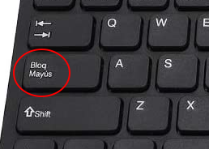
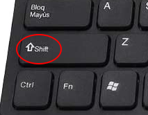
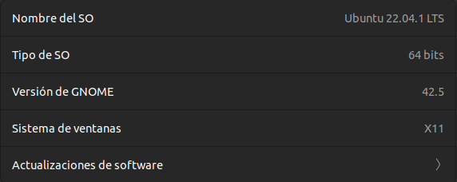
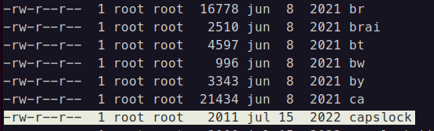
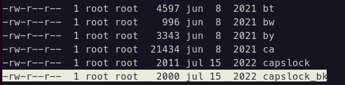
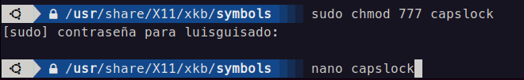
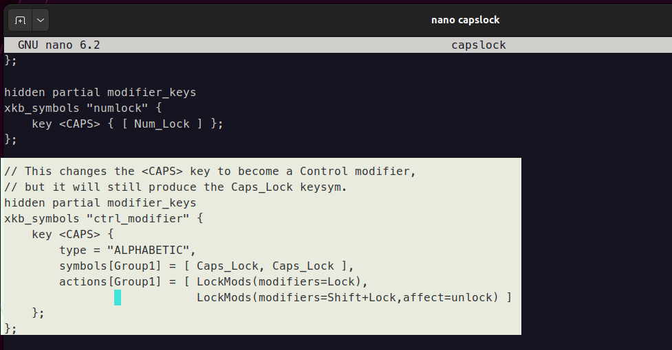
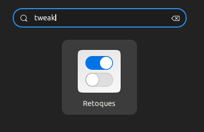
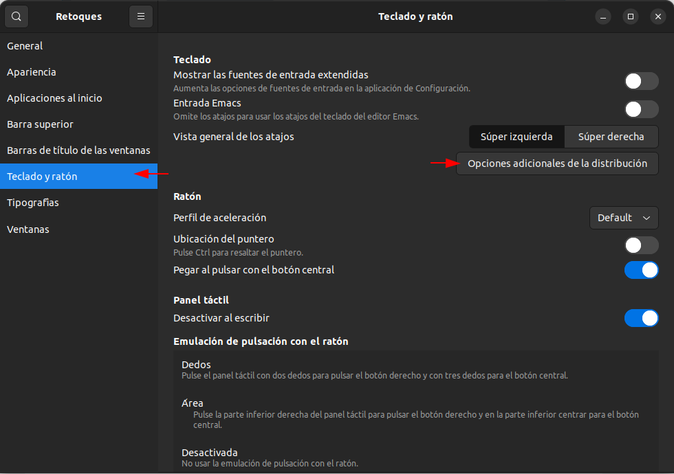
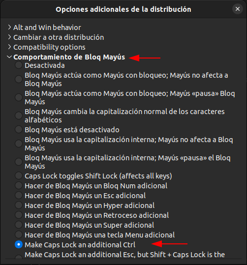

Tengo la (mala) costumbre de usar la tecla **[Bloq Mayus](https://es.wikipedia.org/wiki/Bloq_May%C3%BAs)** cada vez que quiero escribir letras en mayúsculas desde el teclado. Siempre pensé que usar esa tecla era lo «normal» y nunca tuve inconvenientes con ello hasta que me topé por primera vez con [GNU/Linux](https://es.wikipedia.org/wiki/GNU/Linux), específicamente con [Ubuntu](https://ubuntu.com/download). Habrá sido hace unos 7 años cuando quise experimentar con un sistema operativo que no sea el clásico Windows.



<!--truncate-->

**GNU/Linux** es inmenso y aún soy nuevo en este sistema, sin embargo, como parte de mis actividades como developer,  escribir (código, documentación, etc) es de las cosas que más frecuentemente hago. Al usar Ubuntu, llegué a notar que al intercambiar entre minúsculas a mayúsculas mediante la tecla **[Bloq Mayus](https://es.wikipedia.org/wiki/Bloq_May%C3%BAs)** para capitalizar la primera letra de una palabra, existía (y sigue existiendo) un pequeño delay o retraso que ocasionaba (dependiendo de tu velocidad de tipeo) que las dos o tres primeras letras de la palabra queden afectadas por dicha tecla.

Para poner un ejemplo, al escribir mi primer nombre, en lugar de «Luis» solía obtener «LUis» o «LUIs». Esto me sucedía con mucha frecuencia y era demasiado incómodo. Tanto así que fue una de las razones por las que decliné en varias oportunidades de seguir usando GNU/Linux (Ubuntu) como S.O principal.

Luego de un par de años más usando Windows, decidí reintentarlo con Ubuntu. En esta ocasión, probé con adaptarme a la forma habitual de escribir con mayúsculas sin bloqueo: usar la tecla Shift. Al principio, era lento al tipear y me costaba demasiado hacerlo velozmente pero con la práctica pude alcanzar cierto grado de destreza, aunque todavía no con la misma fluidez que logré en Windows usando Bloq Mayus.



Aunque dediqué tiempo a practicar, no logré acostumbrarme a la tecla **Shift** para escribir con la misma comodidad y rapidez que con Bloq Mayús. Por ello, decidí investigar cómo eliminar el «delay» presente en Ubuntu, que, desde mi punto de vista (totalmente subjetivo), le da una gran desventaja frente a Windows.

A continuación, les presento un procedimiento que he probado con éxito en las versiones 20.04 y 22.04 de Ubuntu. Si bien no me he adentrado en los detalles técnicos de la solución, esta me ha permitido obtener el resultado que buscaba: replicar la funcionalidad de Bloq Mayús de Windows y disfrutar de una experiencia de escritura más fluida.

La solución original se puede revisar en este foro: [https://forum.manjaro.org/t/caps-lock-behaviour-wayland/79868/8](https://forum.manjaro.org/t/caps-lock-behaviour-wayland/79868/8).

Los siguientes pasos lo realicé en una máquina con GNU/Linux y distribución Ubuntu 22.04 LTS



Desde la terminal debemos ubicarnos en la siguiente ruta: **/usr/share/X11/xkb/symbols/**

```shell
cd /usr/share/X11/xkb/symbols/
```

Asegurarnos de que existe el archivo capslock.

```shell
ls -al

```



Por siacaso, antes de editar o eliminar algo, tomemos nuestras precauciones y hagamos una copia del archivo. Usaremos el comando **cp** y el archivo copiado se llamará **capslock_bk** (o el nombre que quieran. Yo uso bk por «backup»).

```shell
cp capslock capslock_bk

```



Ya que tenemos una copia de seguridad del archivo **capslock**, podemos experimentar sin temor. En primer lugar, vamos a  tener que cambiarle los permisos con el siguiente comando:

```shell
sudo chmod 777 capslock

```

Ahora vamos a editar el contenido de este archivo. Usaremos el editor **nano** para abrir el archivo **capslock**:



```shell
nano capslock

```

Buscar en el archivo el siguiente contenido:

```shell
// This changes the <CAPS> key to become a Control modifier,
// but it will still produce the Caps_Lock keysym.
hidden partial modifier_keys
xkb_symbols "ctrl_modifier" {
    replace key <CAPS> {
        type[Group1] = "ONE_LEVEL",
        symbols[Group1] = [ Caps_Lock ],
        actions[Group1] = [ SetMods(modifiers=Control) ]
    };
    modifier_map Control { <CAPS> };
};

```

Vamos a reeamplazar lo anterior por lo siguiente:

```shell
// This changes the <CAPS> key to become a Control modifier,
// but it will still produce the Caps_Lock keysym.
hidden partial modifier_keys
xkb_symbols "ctrl_modifier" {
          key <CAPS> {
              type="ALPHABETIC",
              repeat=No,
              symbols[Group1]= [ Caps_Lock, Caps_Lock ],
              actions[Group1]= [ LockMods(modifiers=Lock),
                                 LockMods(modifiers=Shift+Lock,affect=unlock) ]
          };
};
```



Guardamos los cambios presionando la combinación de teclas **CTRL + O**. Y luego la tecla **ENTER** para aceptar.

Después, cerraremos el editor **nano** con el atajo de teclado **CTRL + X**. Estando en la terminal, restauraremos los permisos del archivo **capslock** a como estaba inicialmente:

```shell
sudo chmod 644 capslock

```

Luego, toca instalar **GNOME Tweaks**. La forma más práctica es usando el gestor de paquetes **apt**:

```shell
sudo apt install gnome-tweaks

```

Una vez culminada la instalación de **Gnome Tweaks**, lo abriremos. Puede que lo encontremos con el nombre de «Retoques». Para ello, podemos presionar la tecla «Windows» o sino hacer click en el Dash y luego tipear «tweak» así como en la siguiente imagen:



Cuando se haya abierto la aplicación, nos ubicaremos en la opción **Teclado y Ratón**. Luego, en el lado derecho clickearemos en el botón **Opciones adicionales de la distribución**.



Se abrirá una ventana en la que tendremos que desplegar la opción «Comportamiento de Bloq Mayús» y luego seleccionar la opción **Make Caps Lock an additional Ctrl**.



Con esto ya estaría todo listo. Si no funciona de inmediato, les recomiendo reiniciar el sistema y volver a intentarlo.