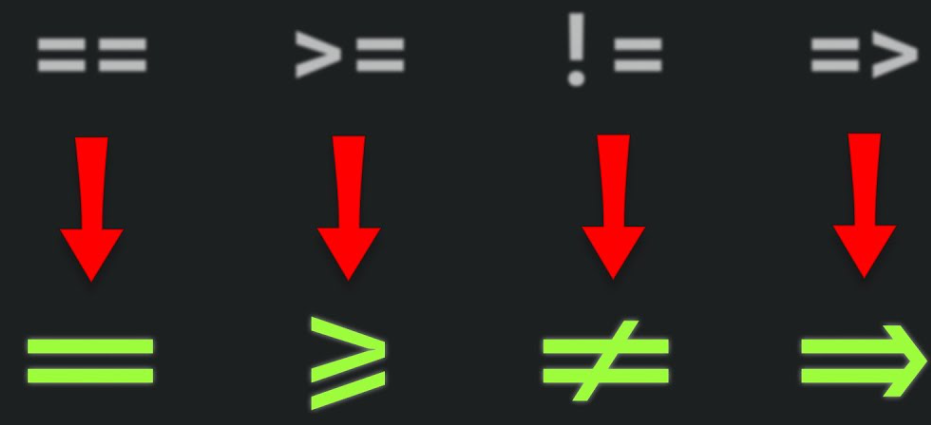
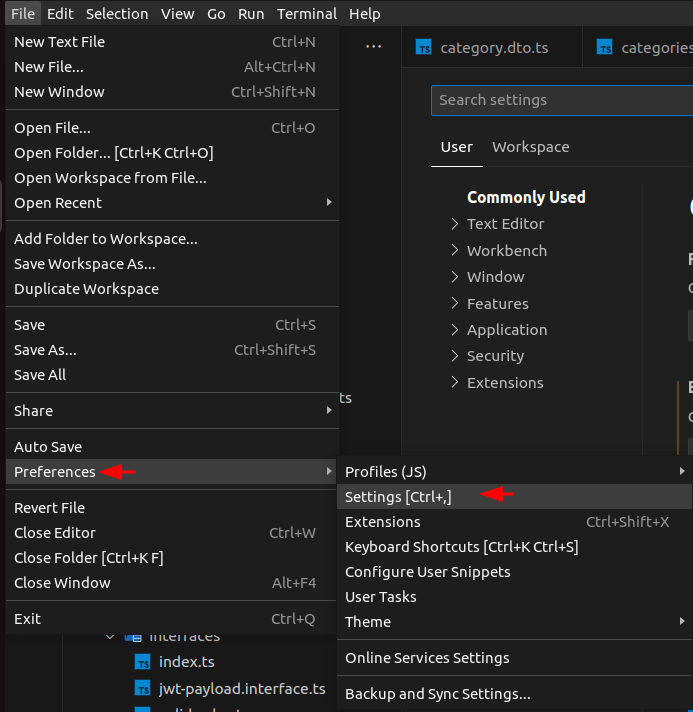
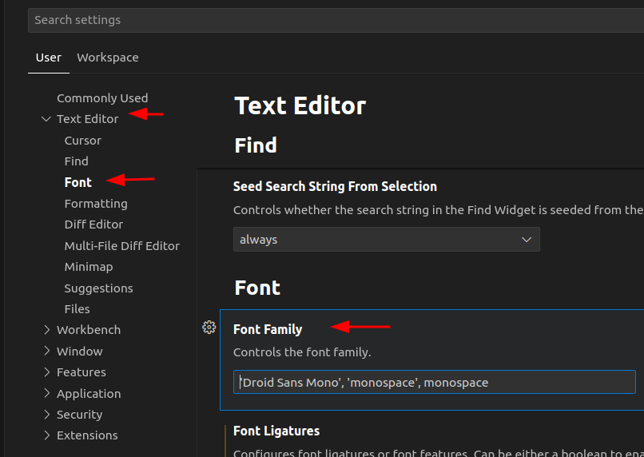
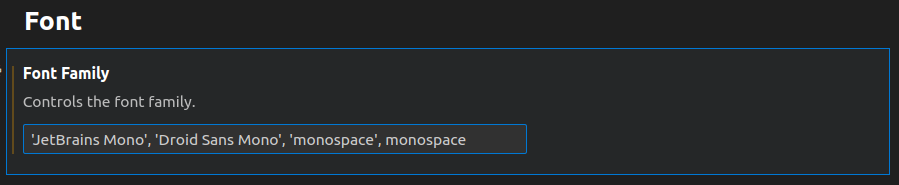
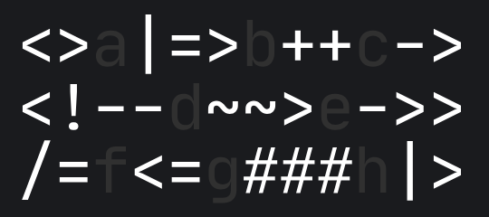
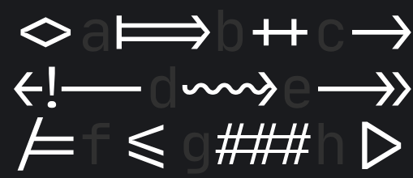
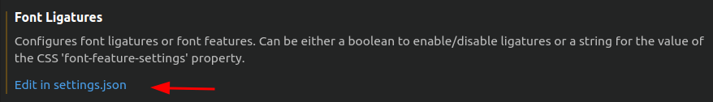
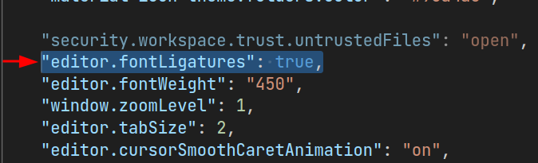
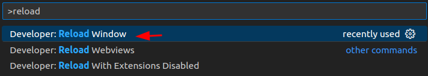
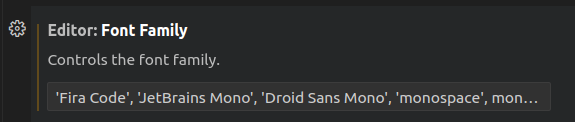

Durante mi tiempo en la programación, he tenido la oportunidad de explorar diferentes tipos de fuentes (aunque no han sido muchas). De todas ellas, mis dos favoritas son **JetBrains Mono** y **Fira Code**. A continuación, comparto los pasos que he seguido para instalarlas en mi sistema **Ubuntu 22.04** y cómo seleccionarlas en Visual Studio Code.

<!--truncate-->

# JetBrains Mono

En internet existen diversas formas de hacerlo, pero mi método preferido es a través del gestor de paquetes apt. Primero, actualizamos los paquetes de nuestro sistema local con la información más reciente de los repositorios de Ubuntu.

```shell
sudo apt update
```

Luego, instalamos el paquete de fuentes llamado `fonts-jetbrains-mono` en nuestro sistema Ubuntu con privilegio de root.

```shell
sudo apt -y install fonts-jetbrains-mono
```

Ahora abrimos VSCode, y entramos a las preferencias: **File / Preferences / Settings**



```shell
Después seleccionamos **Text Editor / Font / Font Family**
```



Dentro del campo de texto de «Font Family», añadimos al principio el nombre de la fuente ‘JetBrains Mono’, incluyendo las comillas simples. Es importante separarlo con comas de cualquier otro nombre de fuente que esté presente. Por ejemplo:

Antes de añadir la fuente `'JetBrains Mono'`

```shell
'Droid Sans Mono', 'monospace', monospace
```

Luego de añadir la fuente `'JetBrains Mono'`

```shell
'JetBrains Mono', 'Droid Sans Mono', 'monospace', monospace
```

Al final debe quedar así:



## Ligadura
Las ligaduras son una característica que traen algunas fuentes y que permite mejorar la visibilidad y la estética del código. Personalmente  me han traido ventajas como: mejora de la legibilidad y estética, distinción rápida de ciertas combinaciones de caracteres, refuerzo en la comprensión semántica del código y flexibilidad de uso (puedo activarlas y desactivarlas cuando lo necesite). 

La siguiente imagen ilustra la diferencia en la visualización de los operadores relacionales ==, >=, != y => con y sin ligaduras (fila superior sin ligaduras, fila inferior con ligaduras):


Aunque no todas las fuentes incluyen ligaduras, JetBrains Mono sí lo hace.

Las siguientes imágenes, tomadas de la página oficial de JetBrains Mono, muestras otros operadores con y sin ligaduras:

**Sin ligaduras**


**Con ligaduras**


Para activar las ligaduras en VSCode, es necesario acceder a la opción **Edit in settings.json** en la sección **Font Ligatures**, la cual se encuentra ubicada debajo de **Font Family**



Se abrirá un archivo settings.json en el que debemos asignar el valor de true a la propiedad `editor.fontLigatures`



Adicionalmente, se puede configurar el grosor de la fuente con la propiedad `editor.fontWeight` asignándole algún valor como:

```shell
"editor.fontWeight": "300" // Light
"editor.fontWeight": "400" // Regular
"editor.fontWeight": "450" // Retina
"editor.fontWeight": "500" // Medium
"editor.fontWeight": "600" // Bold
```


Si los cambios de fuente no se reflejan de inmediado, es posible que sea necesario reiniciar VSCode. Esto se puede hacer rápidamente utilizando el atajo `CTRL+SHIFT+P` y escribiendo **Reload**. Luego, elige la opción **Developer: Reload Window** y pulsa `ENTER`.



# Fira Code
Fira Code es otra de mis fuentes favoritas. El proceso de instalación y configuración en VSCode es idéntico al que mostré para JetBrains Mono. Simplemente hay que instalar la fuente y luego ir a la configuración de Font Family para establecer el nuevo tipo de letra:

```shell
sudo apt install fonts-firacode
```

Antes de agregar la fuente `'Fira Code'`


```shell
'JetBrains Mono', 'Droid Sans Mono', 'monospace', monospace
```

Luego de agregar la fuente `'JetBrains Mono'`

```shell
'Fira Code', 'JetBrains Mono', 'Droid Sans Mono', 'monospace', monospace
```


Al final debe quedar así:




También se pueden activar las ligaduras con Fira Code utilizando el mismo procedimiento que se ha presentado anteriormente.

He probado otras fuentes, pero ninguna me ha terminado de convencer. Como un plus, les comparto un enlace a una web en donde podrán encontrar una amplia variedad de fuentes, tanto con ligaduras como sin ellas. Quién sabe, quizás encuentren tipografías aún mejores: [https://www.programmingfonts.org/](https://www.programmingfonts.org/)
