Flameshot es, sin duda, mi herramienta favorita para hacer capturas de pantalla (screenshot) en Ubuntu 22.04. Sus opciones y flexibilidad me recuerdan mucho al popular LightShot de Windows. 

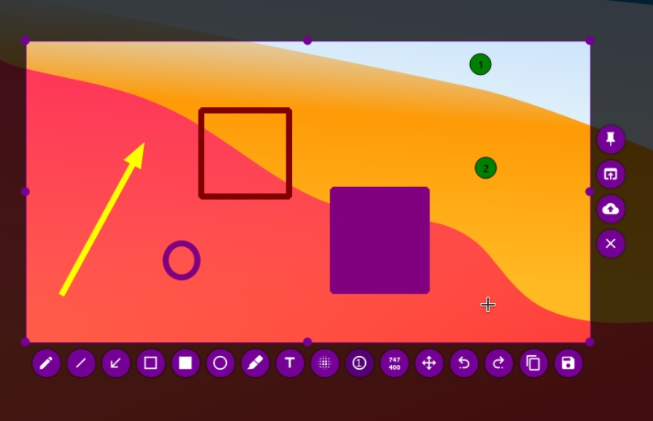

En esta publicación pretendo mostrar su instalación y configuración para que pueda ser utilizado sin problemas junto el capturador de pantalla nativo que viene con Ubuntu 22.04.

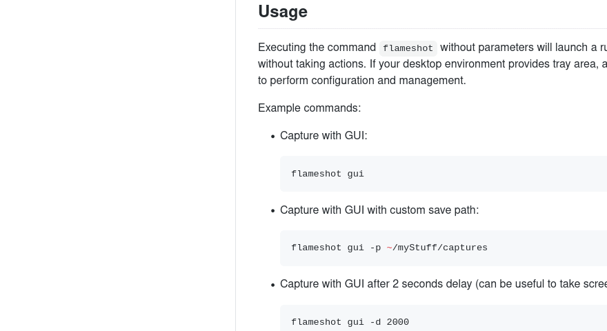

<!--truncate-->

## Instalación
La instalación de Flameshot es directa y rápida. Basta con ejecutar el siguiente comando en la terminal:

```shell
sudo apt install flameshot
``` 

Luego hay que pulsar `y` o `s` (dependiendo del idioma que tengan configurado) para confirmar la instalación.

Una vez culminada la instalación, lo abriremos. Para ello, podemos presionar la tecla “Windows” o sino hacer click en el Dash y luego tipear “flameshot” así como en la siguiente imagen:

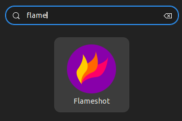

Si nos percatamos, aparecerá el ícono de Flameshot en la barra superior de Ubuntu 22.04. Si le damos clic, se abrirá un menú contextual con todas las opciones que trae.

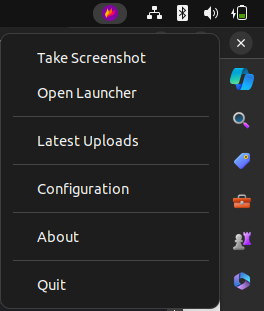

Tiene muchas opciones para poder personalizarlo a gusto.

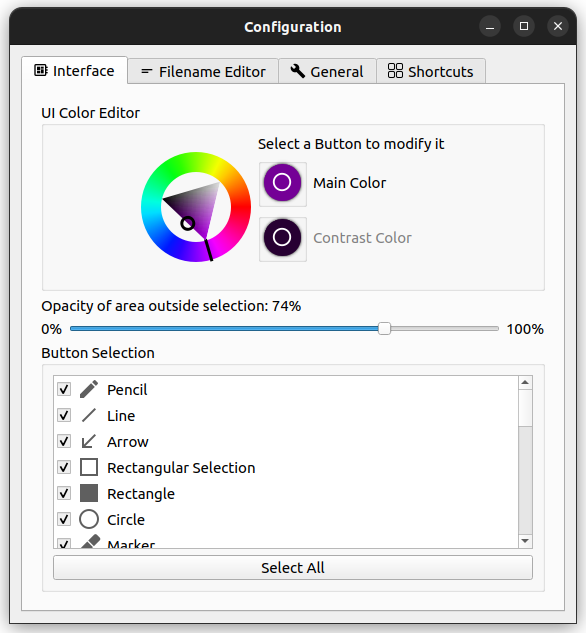


Pero aún queda un detalle… Si pulsamos la tecla «Print screen» (inglés) o «Impr Pant» (español) que es la que se suele usar para obtener capturas de pantalla, se nos abrirá la herramienta nativa de Ubuntu.

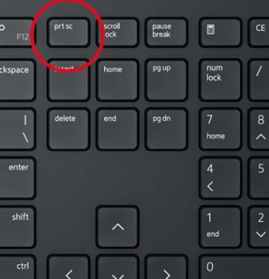


## Configuración del shortcut (atajo de teclado) para usar Flameshot

En esta sección, demostraré cómo ajustar los atajos de teclado en Ubuntu para poder utilizar Flameshot junto con el capturador nativo de Ubuntu sin que entren en conflicto. Para lograrlo, primero configuraré el atajo «Ctrl + Impr Pant» para que active el capturador de pantalla nativo de Ubuntu. Luego, procederé a configurar la tecla «Impr Pant» para que active Flameshot.

### 1 Cambiando el shortcut para el capturador nativo de Ubuntu

Iremos a las configuraciones de Ubuntu. Para ello podemos hacer clic en la esquina superior derecha, donde se ubican los íconos de red, volumen y/o carga de la batería. En el menú contextual que se despliega, hay que elegir **«Settings»**.

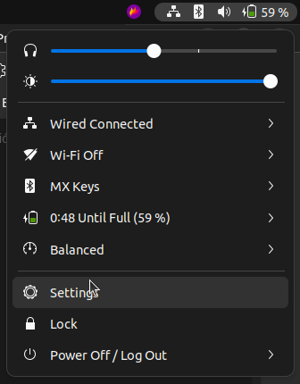

En el panel lateral izquierdo, elegimos la opción «Keyboard». Luego, buscamos la sección **«Keyboard Shortcuts»**.


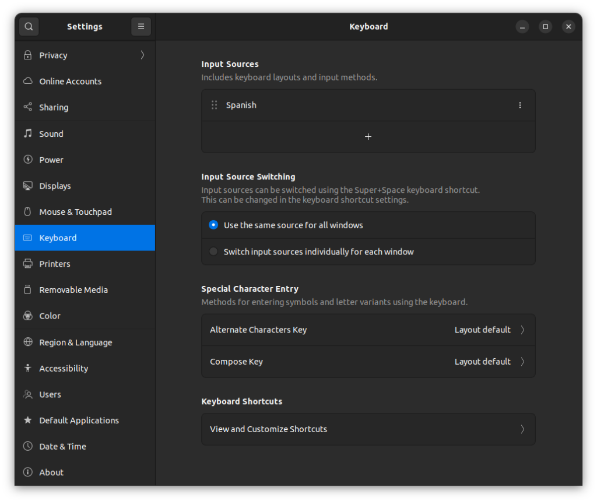

Hacemos clic en el item **View and Customize Shortcuts**.


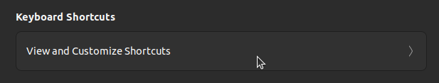

En la ventana que se abre, hacemos clic en **«Screenshots»**.

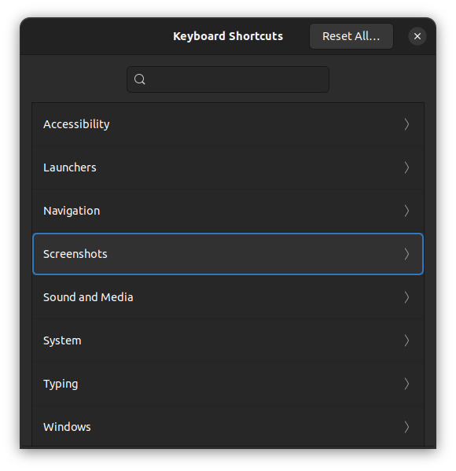

Se abrirá la ventana «Screenshots». En esta ventana buscamos la opción **«Take a screenshot interactively»** y hacemos clic en él. Vemos que por defecto tiene asignada el shortcut **«Print»** el cual corresponde a la tecla **«Print Screen»**.

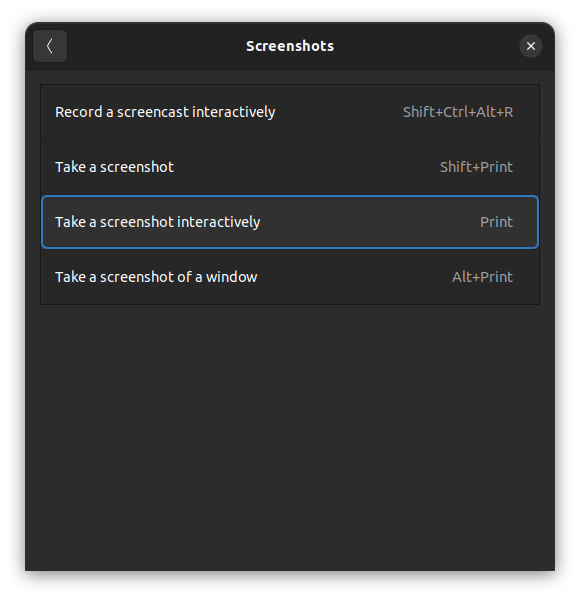

Se nos abrirá la ventana **«Set Shortcut»** donde debemos pulsar el atajo de teclado que queremos asignarle. En nuestro caso, debemos pulsar `«Contrl + Print»`. Acto seguido, hacemos clic en el botón **«Set»** para hacer efectivo el cambio que acabamos de hacer.

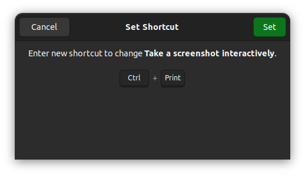

Ahora podemos observar que ha cambiado el shortcut asignado a esta opción.

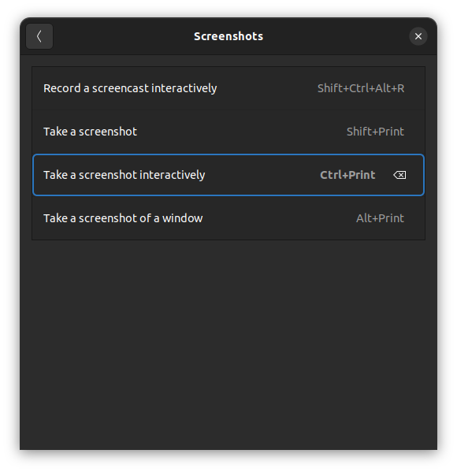


Con estos pasos hemos cambiado el atajo de teclado asignado al capturador de pantalla nativo de Ubuntu. Para terminar esta parte, cerramos la ventana «Screenshots».


### 2 Agregando el shortcut para Flameshot

Debemos volver a ubicarnos en los Settings de Ubuntu. En el panel lateral izquierdo, elegimos la opción «Keyboard». Luego, buscamos la sección **«Keyboard Shortcuts»**. Hacemos clic en el item **«View and Customize Shortcuts»**.


En la ventana **«Keyboard Shortcuts»** buscaremos la opción **«Custom Shortcuts»** y hacemos clic en él.

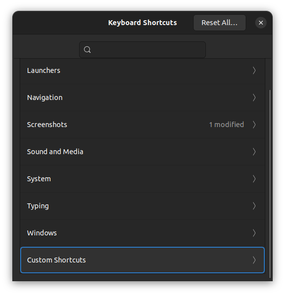


En la ventana que se abre **«Custom Shortcuts»**, hacemos clic en el botón **«Add Shortcut»**.

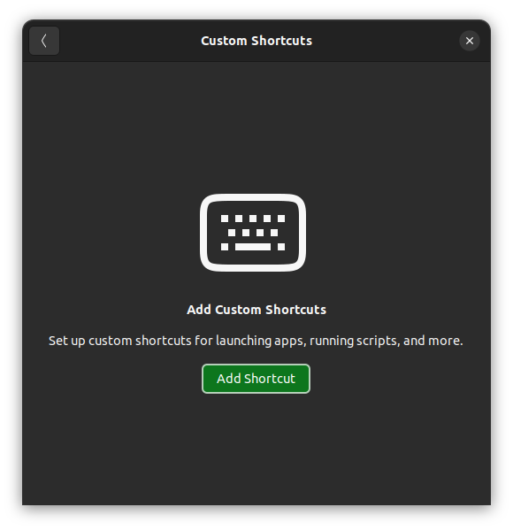


Se abrirá la ventana **«Add Custom Shortcut»**. Aquí vamos asignar el atajo de teclado para ejecutar Flameshot. Para ello, agreguemos lo siguiente:

- Name: **Flameshot**
- Command: **/usr/bin/flameshot gui**

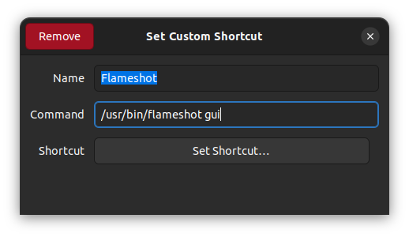


Ahora, hacemos clic en el botón **«Set Shortcut….»**. Se abrirá una ventana donde debemos pulsar la tecla **«Print Screen»**, que es la que queremos asignar por defecto a Flameshot. Luego hacemos clic en el botón **«Add»**.

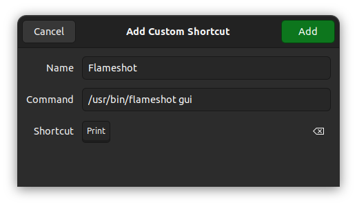

Veremos que en la lista de Atajos personalizados, nos aparece el que acabamos de añadir **«Flameshot»** y la tecla asignada **«Print»**.

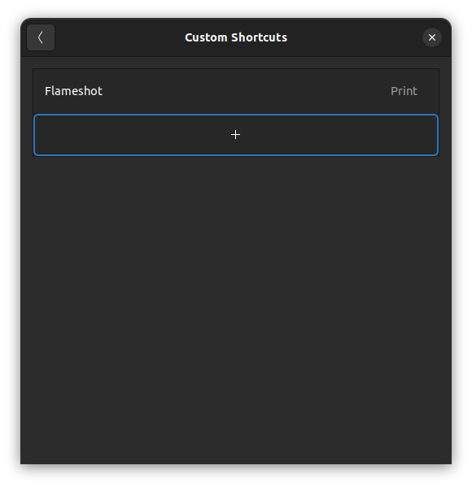


### 3 Ajustes finales
#### Archivo custom.conf
Para terminar, es necesario cambiar del entorno de Wayland al servidor de pantalla Xorg. La razón detrás de este cambio radica en la incompatibilidad parcial de Flameshot con Wayland. Para llevar a cabo esta acción, se requiere editar el archivo /etc/gdm3/custom.conf mediante el siguiente comando:

```shell
sudo nano /etc/gdm3/custom.conf
```

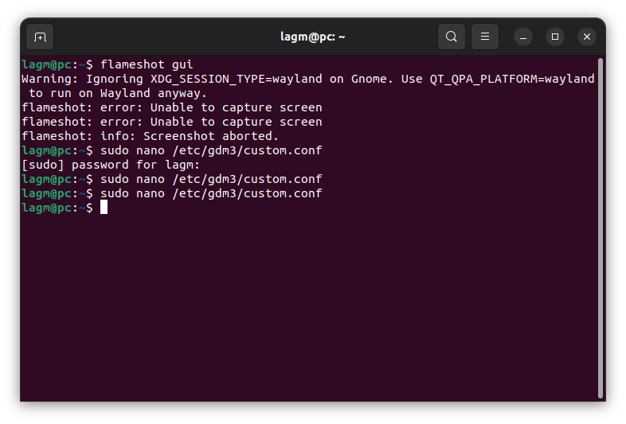

Ubica la línea #WaylandEnable=false y quita el símbolo ‘#’ para descomentarla, de manera que quede así: `WaylandEnable=false`. Presiona `Ctrl+X`, seguido de `Y`, y luego `Enter` para guardar y salir del archivo.

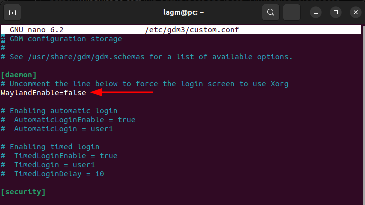


#### Variable de entorno QT_QPA_PLATFORM

- Para .bashrc:
```shell
nano ~/.bashrc
```

- Para .zshrc:
```shell
nano ~/.zshrc
```

Agrega la siguiente línea al final del archivo
```shell
export QT_QPA_PLATFORM=xcb
```

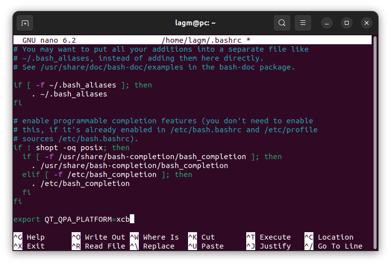

Presiona `Ctrl+X`, seguido de `Y`, y luego `Enter` para guardar y salir del archivo. Luego reinicia la computadora.

Una vez reiniciada la sesión en el sistema, al presionar la tecla «Print Screen», Flameshot se ejecutará automáticamente. Es el momento de empezar a utilizarlo y explorar todas sus opciones.


En este artículo breve, he compartido la forma como configuro mi sistema Ubuntu, permitiéndome utilizar dos herramientas de captura de pantalla: Flameshot y la preinstalada en Ubuntu 22.04. Además, he asegurado que ambas puedan coexistir sin conflictos asignándoles atajos de teclado distintos: Flameshot con **«Print Screen»** y la herramienta nativa con **«Ctrl + Print Screen»**.

Para concluir, me gustaría señalar que he encontrado situaciones en las que Flameshot no pudo realizar capturas de pantalla, mientras que el capturador nativo de Ubuntu sí pudo hacerlo. Este último es capaz de capturar elementos como menús contextuales, el dash e incluso  por encima de Flameshot mismo. Por ello, considero que ambos capturadores son útiles y pueden complementarse entre sí.