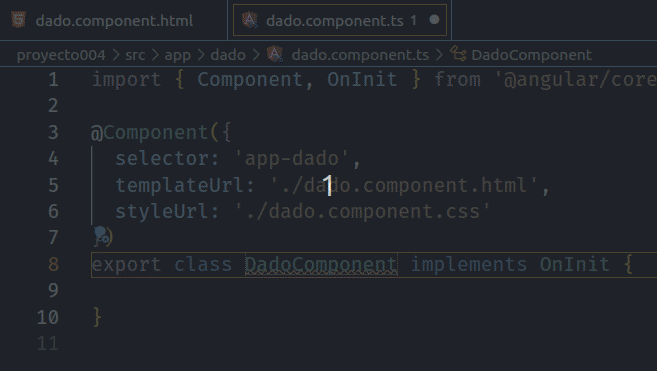
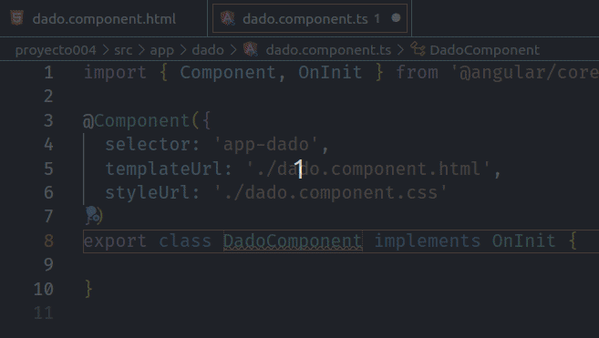
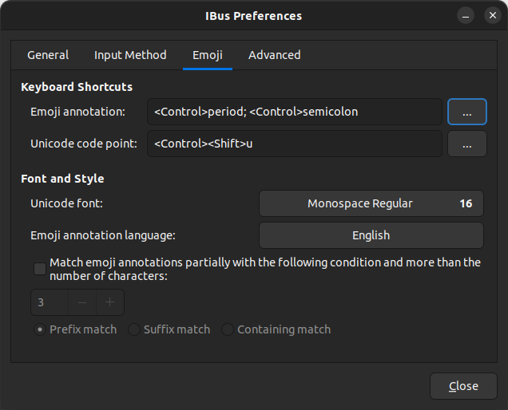
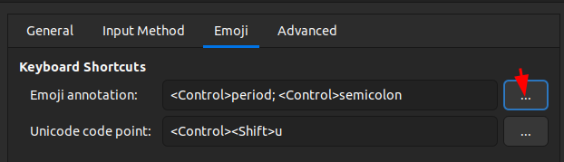
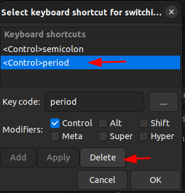
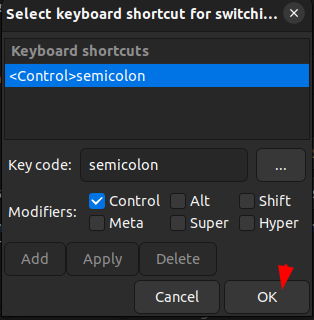

_Imagen del error_


_Comportamiento esperado_


Hace un tiempo, me enfrenté a una complicación al emplear el atajo de teclado `CTRL + .` en Visual Studio Code, una acción que suelo utilizar de manera habitual para implementar automáticamente los métodos de una interfaz dentro de una clase. En lugar de recibir la sugerencia anticipada por parte de VSCode para completar la importación, me encontré con la aparición de un carácter \"e\" subrayado, lo que, además de interrumpir mi trabajo, desactivaba el funcionamiento de otras teclas. En estos casos, para restablecer la normalidad tenía que pulsar la tecla `Esc`.

Afortunadamente, después de googlear un poco, pude encontrar la solución. Al menos sirve hasta que lo parchen. A continuación, compartiré los pasos que seguí para resolver este problema, en caso de que puedan ser útiles para alguien más.

<!--truncate-->

   
## Pasos para resolver el problema
Abre la configuración de IBus ejecutando **ibus-setup** en la terminal. Ingresa el siguiente comando:

```
ibus-setup
```

Se abrirá la siguiente ventana:



Seleccionar la pestaña **Emoji**. Verás en la sección **Emoji annotation** el valor `<Control>semicolon`



Dale clic en el botón con los puntos suspensivos **...** que se encuentra ubicado al lado derecho. Se abrirá otra ventana. 



Allí selecciona 
**Control period** y luego bórralo con el botón **Delete**

Finalmente has clic en el botón **OK** y cierra las ventanas. Eso sería todo.



Discusiones en internet que profundizan en este problema:
- https://stackoverflow.com/questions/75360949/how-do-i-get-imports-to-show-up-when-i-press-ctrldot-in-javascript-in-vscode
- https://stackoverflow.com/questions/71997823/ctrl-dot-makes-e-appear-instead-of-showing-suggestions-in-vscode-on-gnome
- https://www.reddit.com/r/gnome/comments/v5p8fi/you_can_insert_emoji_quickly_by_pressing_ctrl/